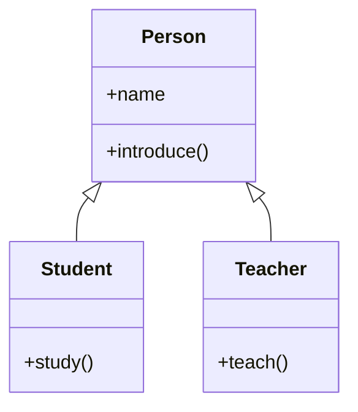

# Object-Oriented Programming in Python

## Learning Objectives

By the end of this session, students will be able to:

1. Explain what Object-Oriented Programming means and why it exists.
2. Distinguish between a **class**, an **object**, an **instance**, and a **type**.
3. Explain `self` at both an intuitive and a mechanical level.
4. Explain what `__init__` really does (and does not do).
5. Distinguish instance attributes from class attributes.
6. Write instance methods, and know what class/static methods are for.
7. Explain inheritance conceptually (IS-A) and technically (attribute lookup).
8. Override methods and use `super()` correctly.
9. Identify and implement all five types of inheritance in Python.
10. Read and predict Method Resolution Order (MRO), including the diamond problem.
11. Use `isinstance()` and `issubclass()` correctly.
12. Explain polymorphism through inheritance.
13. Decide between inheritance (IS-A) and composition (HAS-A).
14. Read real Django-style class hierarchies with basic confidence.

> **Instructor Note:** This is a 90–120 minute first session on OOP. The goal is a *strong, correct mental model*, not full mastery. Sections 13–14 (types of inheritance, MRO) are the emotional core of this lesson — spend real time there.

---

## 1. Before OOP

Let's start where most beginners actually are: writing code with plain variables and functions.

```python
student_name = "Ali"
student_age = 20

def display_student(name, age):
    print(f"Name: {name}")
    print(f"Age: {age}")

display_student(student_name, student_age)
```

This works fine — for one student. Now imagine a real application with 200 students, each needing a name, age, grades, and behaviors like `enroll()`, `submit_assignment()`, `calculate_gpa()`.

Problems appear quickly:

- **Duplicated data** — every student needs its own `name`, `age` variables; you'd need `student_name_1`, `student_name_2`, ... or parallel lists that must always stay in sync.
- **Duplicated behavior** — functions like `display_student()` need to be called with the right variables every time, and nothing stops you from passing mismatched data (`display_student(student_age, student_name)` — bug, but Python won't warn you).
- **No natural link between data and behavior** — the function `display_student` and the data `student_name` aren't actually *connected* in Python's eyes. They just happen to be used together by convention.
- **Poor scalability** — as the number of "things" your program models grows (students, teachers, courses, payments), procedural code turns into a tangle of parallel data structures and free-floating functions.
- **Hard to model real-world entities** — a "Student" is a *thing* with both properties and behavior. Plain variables and functions don't capture that unity.

> **Instructor Note:** Let students feel the pain before rescuing them. Ask: *"What would you need to change if we now had 100 students?"* Let them realize the current approach breaks down.

This leads to the central idea of OOP:

> **What if we could keep the data and the behavior that operates on that data bundled together, as a single unit?**

That single unit is an **object**. OOP is the paradigm built around creating and using objects.

---

## 2. What Is OOP?

### Simple definition
OOP is a way of structuring code around **objects** — units that combine **data** (attributes) and **behavior** (methods) together.

### Technical definition
OOP is a programming paradigm based on the concept of **classes** (blueprints that define structure and behavior) and **objects** (instances of those classes), typically supporting **encapsulation**, **inheritance**, and **polymorphism**.

### Real-world analogy
A blueprint for a house describes rooms, doors, and wiring — it's not a house you can live in. Each house built from that blueprint is a separate, real house. The blueprint is the **class**; each actual house is an **object**.

### Python-specific explanation: you've been using OOP already

```python
name = "Ali"
print(name.upper())
```

- `"Ali"` is an **object** (a `str` object).
- `upper()` is a **method** — behavior provided by the object's type (`str`).
- `str` is the **class** (type) that `"Ali"` belongs to.

```python
numbers = [1, 2, 3]
numbers.append(4)
print(numbers)  # [1, 2, 3, 4]
```

- `numbers` is a `list` object.
- `.append()` is a method defined on the `list` class.
- Every string, list, dict, integer, and function you've used has been an object with a type, attributes, and methods — you just hadn't named the concept yet.

> **Common Question:** *"So is Python 100% OOP then, since everything is an object?"*
> Not quite — we address this directly at the end of Section 3, and it's worth flagging early: Python is **object-oriented under the hood**, but it does **not force** you to write OOP-style code. You can write an entire Python program using only functions (procedural style) — Python won't stop you. This makes Python a **multi-paradigm language that is deeply object-oriented internally, but only partially / optionally object-oriented in the style it enforces** — unlike Java, where all code must live inside a class.

```python
# 100% valid, idiomatic Python — no class in sight
def add(a, b):
    return a + b

print(add(3, 4))  # 7
```

---

## 3. Class vs Object

Key terms:

| Term | Meaning |
|---|---|
| **Class** | The blueprint/definition — describes what attributes and methods objects of this type will have |
| **Object** | A concrete thing that exists in memory, created from a class |
| **Instance** | Another word for "object", used specifically to emphasize its relationship to a class (e.g., "`student1` is an instance of `Student`") |
| **Type** | The class an object belongs to; `type(obj)` returns it |

```python
class Student:
    pass

student1 = Student()
student2 = Student()
```

- `Student` is the **class** — it exists once, and describes what a "Student object" is.
- `student1` and `student2` are **objects** (instances) created from that class — they exist independently in memory.

```python
print(type(student1))       # <class '__main__.Student'>
print(type(student2))       # <class '__main__.Student'>
print(student1 is student2) # False
```

- Both have the **same type** (`Student`) — they were built from the same blueprint.
- But `student1 is student2` is `False` — they are **different objects in memory**, just like two houses built from the same blueprint are still two separate houses.

> **Teaching Tip:** Ask students to predict the output of `student1 is student2` *before* running it, and ask *why* it's `False` even though both are `Student` objects.

```mermaid
classDiagram
    class Student
    Student : (blueprint)
    Student <.. student1 : instance of
    Student <.. student2 : instance of
```

---

## 4. Creating Our First Class

```python
class Student:
    def __init__(self, name, age):
        self.name = name
        self.age = age

    def introduce(self):
        print(f"My name is {self.name} and I am {self.age} years old.")


student1 = Student("Ali", 20)
student2 = Student("Sara", 22)

student1.introduce()  # My name is Ali and I am 20 years old.
student2.introduce()  # My name is Sara and I am 22 years old.
```

Line-by-line:

- `class Student:` — defines a new class named `Student`.
- `def __init__(self, name, age):` — a special method (the **constructor/initializer**) that runs automatically when a new `Student` object is created.
- `self.name = name` — stores `name` as an **attribute** on this specific object (its *state*).
- `def introduce(self):` — an **instance method**: behavior that operates on a specific object's state.
- `student1 = Student("Ali", 20)` — creates a new object; Python calls `__init__` automatically, passing the new object as `self`.
- `student1.introduce()` — calls `introduce`, using `student1`'s own data.

Each object has its own **state** (`name`, `age`) but shares the same **behavior** (`introduce`) defined once, in the class.

---

## 5. Deep Dive Into `self`

This is the single most important concept to get right early — and the most commonly memorized-without-understanding.

**Do not** just tell students "`self` means the current object." Prove it.

```python
class Student:
    def introduce(self):
        print(self.name)
```

When you call:

```python
student1.introduce()
```

Python is conceptually doing this:

```python
Student.introduce(student1)
```

That is: **calling a method on an object is just syntax sugar for calling the function on the class and passing the object in as the first argument.** `self` is simply the name given to that first parameter — the object the method was called on.

```python
student1.introduce()   # self becomes student1
student2.introduce()   # self becomes student2
```

You can even prove it directly:

```python
class Student:
    def __init__(self, name):
        self.name = name

    def introduce(self):
        print(self.name)

s = Student("Ali")
s.introduce()             # Ali        (normal call)
Student.introduce(s)      # Ali        (explicit, equivalent call)
```

> **Important:** `self` is **not a Python keyword**. It's just a strong convention. Python doesn't care what you call it:

```python
class Student:
    def introduce(current_object):
        print(current_object.name)
```

This runs identically — but **never write it this way**. Every Python developer expects `self`; breaking that convention makes your code confusing to everyone else (and to future you).

### `self.name` vs `name` — instance attribute vs local variable

```python
class Student:
    def __init__(self, name):
        name = name          # local variable only — lost when __init__ ends!
        # self.name is never set

s = Student("Ali")
print(s.name)   # AttributeError: 'Student' object has no attribute 'name'
```

Without `self.`, `name` is just a local variable inside `__init__` that disappears the moment the function returns. Writing `self.name = name` is what actually **attaches** the data to the object, making it part of its permanent state.

> **Teaching Question:** *What happens when I call `student.introduce()`?* — walk through: Python looks up `introduce` on `Student`, finds it as an unbound function, and calls it as `Student.introduce(student)`, so `self` becomes `student`.

---

## 6. `__init__`

```python
class Student:
    def __init__(self, name, age):
        self.name = name
        self.age = age
```

- `__init__` runs **automatically** right after a new object is created.
- By the time `__init__` runs, `self` already refers to a real (but "empty") object — `__init__`'s job is to **initialize** its attributes, not to create the object itself.

> **Correcting a common misconception:** *"`__init__` creates the object."* — **False.** Object *creation* is actually handled by a different special method, `__new__`, which runs first and returns a new, bare object. `__init__` then receives that object as `self` and sets it up. In everyday Python code, you almost never touch `__new__` — but it's worth knowing they're two separate steps:

```text
Student("Ali", 20)
        │
        ▼
1. __new__   → creates a new, empty Student object in memory
        │
        ▼
2. __init__  → receives that object as `self`, sets self.name and self.age
        │
        ▼
   Ready-to-use object returned to you
```

---

## 7. Instance vs Class Attributes

```python
class Student:
    university = "Mansoura University"   # class attribute — shared by ALL instances

    def __init__(self, name):
        self.name = name                 # instance attribute — unique per object


student1 = Student("Ali")
student2 = Student("Sara")

print(student1.name)         # Ali
print(student2.name)         # Sara
print(student1.university)   # Mansoura University
print(student2.university)   # Mansoura University
print(Student.university)    # Mansoura University
```

- `university` is defined **on the class**, so every instance shares the exact same value unless overridden.
- `name` is defined **on each instance** (via `self.name = ...` in `__init__`), so it's independent per object.

Now, what happens if an instance sets an attribute with the same name as a class attribute?

```python
student1.university = "Cairo University"

print(student1.university)   # Cairo University   <- instance attribute now shadows the class one
print(student2.university)   # Mansoura University <- unaffected
print(Student.university)    # Mansoura University <- unaffected
```

**Attribute lookup rule:** when you access `obj.attribute`, Python first checks the **instance's own `__dict__`**; only if it's not found there does it fall back to the **class** (and then the class's parents). Assigning `student1.university = "..."` creates a *new* instance attribute that shadows — but doesn't modify — the class attribute.

---

## 8. Methods

### Instance methods
The default and most common kind. First parameter is `self` (the calling object). Used when behavior needs access to that specific object's data.

```python
class Student:
    def __init__(self, name):
        self.name = name

    def introduce(self):          # instance method
        print(f"I'm {self.name}")
```

### Class methods
Operate on the **class itself**, not a specific instance. First parameter is conventionally `cls`. Defined with `@classmethod`. Common use: alternative constructors.

```python
class Student:
    university = "Mansoura University"

    def __init__(self, name):
        self.name = name

    @classmethod
    def change_university(cls, new_university):
        cls.university = new_university

Student.change_university("Cairo University")
print(Student.university)  # Cairo University
```

### Static methods
Don't need access to the instance (`self`) or the class (`cls`) at all — just a utility function that logically belongs inside the class. Defined with `@staticmethod`.

```python
class Student:
    @staticmethod
    def is_valid_age(age):
        return age > 0

print(Student.is_valid_age(20))   # True
print(Student.is_valid_age(-5))   # False
```

> **Common mistake:** forgetting `self` in an instance method definition — Python will complain that the method got too many arguments, because `self` is passed automatically by the calling syntax `obj.method(...)`.

> **Teaching Note:** This lesson's main focus is inheritance, so don't linger long on `classmethod`/`staticmethod` — one clear example each is enough for today.

---

## 9. Why Inheritance?

Notice the duplication problem returning at the class level:

```python
class Student:
    def __init__(self, name):
        self.name = name

    def study(self):
        print(f"{self.name} is studying")


class Teacher:
    def __init__(self, name):
        self.name = name          # duplicated!
    def teach(self):
        print(f"{self.name} is teaching")
```

Both classes need a `name` and an `__init__` that sets it. This duplication is exactly the same problem we saw in Section 1 — just one level up.



The fix: define the shared parts **once**, in a common parent class, and let `Student` and `Teacher` **inherit** from it.

### IS-A relationship

Inheritance models an **"IS-A"** relationship:

- A Student **is a** Person.
- A Teacher **is a** Person.
- A Dog **is an** Animal.
- A Car **is a** Vehicle.

### Contrast: HAS-A relationship (composition — previewed here, detailed in Section 17)

- A Car **has an** Engine.
- A Computer **has a** CPU.
- An Order **has** Products.

> **Teaching Question:** *Is a Car an Engine, or does a Car have an Engine?* Get students to answer this before moving on — it's the seed for Section 17.

---

## 10. Basic Inheritance

```python
class Person:
    def __init__(self, name):
        self.name = name

    def introduce(self):
        print(f"I am {self.name}, a person")


class Student(Person):   # Student inherits from Person
    pass


student = Student("Ali")
student.introduce()      # I am Ali, a person
```

`Student` defines nothing of its own, yet `student.introduce()` works, and even `__init__` (which sets `self.name`) works — because `Student` inherited *everything* from `Person`.

**Terminology:**
- `Person` = **parent / base / superclass**
- `Student` = **child / derived / subclass**

**How does Python find `introduce()` on a `Student` object?**

1. Python looks at `student`'s own instance `__dict__` — no `introduce` there.
2. Python looks at `student`'s class, `Student` — no `introduce` defined there either.
3. Python looks at `Student`'s parent, `Person` — finds `introduce` there. Uses it.

This is the same **attribute lookup chain** from Section 7, just extended up through the inheritance tree.

---

## 11. Method Overriding

A child class can **redefine** a method it inherited, replacing the parent's version with its own.

```python
class Person:
    def introduce(self):
        print("I am a person")


class Student(Person):
    def introduce(self):             # overrides Person.introduce
        print("I am a student")


p = Person()
s = Student()

p.introduce()   # I am a person
s.introduce()   # I am a student
```

When Python looks up `introduce` on `s`, it finds it **directly on `Student`** first (step 2 of the lookup chain above) — so it never even needs to check `Person`. The child's version "wins."

This is the technical foundation of **polymorphism** (Section 16): different classes can respond to the exact same method call (`introduce()`) with different behavior.

---

## 12. `super()`

What if the child wants to **extend**, not fully replace, the parent's behavior — especially inside `__init__`?

```python
class Person:
    def __init__(self, name):
        self.name = name


class Student(Person):
    def __init__(self, name, university):
        super().__init__(name)      # delegate to Person's __init__
        self.university = university


s = Student("Ali", "Mansoura University")
print(s.name, s.university)   # Ali Mansoura University
```

Why not just duplicate the logic?

```python
class Student(Person):
    def __init__(self, name, university):
        self.name = name            # duplicated logic — same problem as Section 9
        self.university = university
```

This works today, but if `Person.__init__` later grows more complex (validation, logging, more attributes), every subclass that duplicated it must be updated by hand. `super().__init__(name)` delegates that responsibility back to `Person`, so `Student` only needs to know about *its own* new attribute (`university`).

You *could* also write:

```python
Person.__init__(self, name)
```

This happens to work for single inheritance, but it's discouraged because it hardcodes the parent's name and — critically — **doesn't respect the Method Resolution Order** in more complex (especially multiple-inheritance) hierarchies. `super()` does.

> **Important:** Do **not** describe `super()` simply as "the parent." It's more precise — and this matters — to say: `super()` returns a proxy that continues the method lookup along the **MRO**, starting *after* the current class. In single inheritance this happens to look identical to "calling the parent," but in multiple inheritance it is not the same thing at all. We'll prove this in Section 14.

---

## 13. Types of Inheritance

Python supports **five** patterns of inheritance.

### 13.1 Single Inheritance

**Definition:** One child class inherits from exactly one parent class.

```text
Animal
   ↓
 Dog
```

**Real-world example:** A `Dog` is a specific kind of `Animal`.

```python
class Animal:
    def eat(self):
        print("Eating")


class Dog(Animal):
    def bark(self):
        print("Barking")


d = Dog()
d.eat()    # Eating   (inherited)
d.bark()   # Barking  (own)
```

**Advantages:** Simple, predictable, easy to reason about.
**Potential problems:** None specific to single inheritance — it's the safest, most common form.
**When to use:** Whenever there's a clean, single "IS-A" relationship.
**Common mistake:** Forgetting to call `super().__init__()` when the child also defines `__init__`, silently losing the parent's setup logic.

---

### 13.2 Multilevel Inheritance

**Definition:** A chain of inheritance — a class inherits from a class that itself inherits from another.

```text
Animal
   ↓
Mammal
   ↓
 Dog
```

```python
class Animal:
    def eat(self):
        print("Eating")


class Mammal(Animal):
    def walk(self):
        print("Walking")


class Dog(Mammal):
    def bark(self):
        print("Barking")


d = Dog()
d.eat()    # Eating   (from Animal, two levels up)
d.walk()   # Walking  (from Mammal, one level up)
d.bark()   # Barking  (own)
```

**Advantages:** Models natural hierarchies (Animal → Mammal → Dog mirrors biological taxonomy).
**Potential problems:** Chains that grow too deep become hard to trace — you may need to check several ancestor classes to understand where a method comes from.
**When to use:** When there's a genuine multi-level "IS-A" chain, not just "it might be useful later."

---

### 13.3 Hierarchical Inheritance

**Definition:** Multiple child classes inherit from the **same** single parent.

```text
        Animal
       /      \
     Dog      Cat
```

```python
class Animal:
    def __init__(self, name):
        self.name = name

    def eat(self):
        print(f"{self.name} is eating")


class Dog(Animal):
    def bark(self):
        print(f"{self.name} says Woof!")


class Cat(Animal):
    def meow(self):
        print(f"{self.name} says Meow!")


d = Dog("Rex")
c = Cat("Whiskers")

d.eat(); d.bark()   # Rex is eating / Rex says Woof!
c.eat(); c.meow()   # Whiskers is eating / Whiskers says Meow!
```

**Advantages:** Shared logic lives in one place (`Animal`); each sibling adds its own specialization.
**Potential problems:** If one sibling needs a special case in the shared parent method, you risk `if isinstance(self, Dog): ...` creeping into the parent class — a sign the design needs rethinking.
**When to use:** Multiple distinct "kinds" of the same general concept.

---

### 13.4 Multiple Inheritance

**Definition:** A single child class inherits from **more than one** parent class directly.

```text
      Father      Mother
          \       /
           \     /
           Child
```

```python
class Father:
    def work(self):
        print("Father works")


class Mother:
    def cook(self):
        print("Mother cooks")


class Child(Father, Mother):
    pass


c = Child()
c.work()   # Father works
c.cook()   # Mother cooks
```

**Why Python supports this:** Unlike some languages (e.g., Java, which disallows multiple class inheritance to avoid ambiguity), Python allows it directly, using a well-defined algorithm (MRO — Section 14) to resolve any ambiguity.

**Potential problem — ambiguity:** What if `Father` and `Mother` both define a method with the same name?

```python
class Father:
    def greet(self):
        print("Father greets")


class Mother:
    def greet(self):
        print("Mother greets")


class Child(Father, Mother):
    pass


Child().greet()   # Father greets  <- resolved by MRO, left-to-right
```

Python resolves this deterministically — it's not random — but you must understand MRO (next section) to predict it confidently.

**When to use:** Sparingly, and mainly for combining unrelated "capabilities" (a pattern often called *mixins*), not for combining deep, overlapping hierarchies.

---

### 13.5 Hybrid Inheritance

**Definition:** A combination of two or more of the patterns above in the same hierarchy.

```text
        Animal
          |
        Mammal          Pet
          |               |
          +------ Dog -----+
```

```python
class Animal:
    def eat(self):
        print("Animal eats")


class Mammal(Animal):          # multilevel
    def walk(self):
        print("Mammal walks")


class Pet:
    def play(self):
        print("Pet plays")


class Dog(Mammal, Pet):        # multiple, on top of multilevel = hybrid
    def bark(self):
        print("Dog barks")


d = Dog()
d.eat(); d.walk(); d.play(); d.bark()
```

**When to use:** When your real-world model genuinely has this shape — not by default. Hybrid hierarchies are powerful but the hardest to reason about; always check `__mro__` (next section) when in doubt.

---

## 14. MRO (Method Resolution Order)

MRO is the precise, deterministic order Python uses to search classes for an attribute or method — it's the mechanism *behind* everything we did informally in Sections 10–13.

```python
class A:
    def hello(self):
        print("A")

class B(A):
    def hello(self):
        print("B")

class C(A):
    def hello(self):
        print("C")

class D(B, C):
    pass

D().hello()
print(D.__mro__)
```

Output:

```text
B
(<class '__main__.D'>, <class '__main__.B'>, <class '__main__.C'>, <class '__main__.A'>, <class 'object'>)
```

`D().hello()` prints `B`, because Python searches in this exact order: `D` → `B` → `C` → `A` → `object`, and `B` is the first class in that list that actually defines `hello`.

You can inspect this two ways:

```python
D.__mro__     # tuple form
D.mro()       # list form, same order
```

### The Diamond Problem

```text
        A
       / \
      B   C
       \ /
        D
```

If `B` and `C` both inherit from `A`, and `D` inherits from both `B` and `C`, which version of a method defined in `A` (and possibly overridden differently in `B` and `C`) should `D` use? Naively, this is ambiguous — this is the classic **diamond problem**. Python resolves it with a deterministic algorithm called **C3 linearization**, which guarantees:

- A class always appears before its parents.
- The left-to-right order you wrote in the class definition is respected.
- Every class appears exactly once in the MRO, no matter how many paths lead to it.

### `super()` follows the MRO — not just "the parent"

This is the payoff of Section 12's warning. Watch this cooperative example:

```python
class A:
    def process(self):
        print("A")

class B(A):
    def process(self):
        print("B")
        super().process()

class C(A):
    def process(self):
        print("C")
        super().process()

class D(B, C):
    def process(self):
        print("D")
        super().process()

D().process()
print(D.__mro__)
```

Output:

```text
D
B
C
A
(<class '__main__.D'>, <class '__main__.B'>, <class '__main__.C'>, <class '__main__.A'>, <class 'object'>)
```

Notice: `B.process()` calls `super().process()` — and it lands on `C`, **not** on `A`! If `super()` simply meant "my parent," this should have gone straight from `B` to `A`. Instead, `super()` inside `B` moves to the **next class after `B` in `D`'s MRO**, which is `C`. This is exactly why `super()` must be understood as "continue along the MRO," not "call my parent."

> **Teaching Tip:** Have students predict this output *before* running it. Almost everyone predicts `D, B, A` the first time. Use the surprise as the teaching moment.

---

## 15. `isinstance()` and `issubclass()`

```python
class Animal:
    pass

class Dog(Animal):
    pass

d = Dog()

print(isinstance(d, Dog))      # True   - d is a Dog
print(isinstance(d, Animal))   # True   - d is ALSO an Animal (inherited)
print(isinstance(d, str))      # False

print(issubclass(Dog, Animal)) # True   - Dog inherits from Animal
print(issubclass(Animal, Dog)) # False  - the reverse is not true
```

- `isinstance(object, Class)` — asks: *"is this object an instance of this class (or one of its subclasses)?"* Works on **objects**.
- `issubclass(ClassA, ClassB)` — asks: *"does ClassA inherit from ClassB (directly or indirectly)?"* Works on **classes**, not objects.

> **Common mistake:** confusing the two — trying `issubclass(d, Animal)` (passing an object instead of a class) raises a `TypeError`.

**Output prediction exercise:**

```python
class Vehicle: pass
class Car(Vehicle): pass
class SportsCar(Car): pass

sc = SportsCar()
print(isinstance(sc, Vehicle))       # ?
print(isinstance(sc, Car))           # ?
print(issubclass(SportsCar, Vehicle))# ?
print(issubclass(Vehicle, SportsCar))# ?
```

All four are `True, True, True, False` — because `isinstance`/`issubclass` walk the *entire* ancestor chain, not just the direct parent.

---

## 16. Polymorphism

> **Key idea:** Same interface (method name), different behavior, depending on the actual object's class.

```python
class Dog:
    def make_sound(self):
        print("Bark")

class Cat:
    def make_sound(self):
        print("Meow")

animals = [Dog(), Cat()]

for animal in animals:
    animal.make_sound()   # Bark, then Meow
```

Notice `Dog` and `Cat` here don't even share a parent — this is possible because Python uses **duck typing** ("if it walks like a duck and quacks like a duck..."): it doesn't check the type before calling `make_sound()`, it just calls it and trusts the object to respond.

Inheritance-based polymorphism (more common, and safer, in larger systems):

```python
class Animal:
    def make_sound(self):
        raise NotImplementedError

class Dog(Animal):
    def make_sound(self):
        print("Bark")

class Cat(Animal):
    def make_sound(self):
        print("Meow")

def announce(animal: Animal):
    animal.make_sound()

for a in [Dog(), Cat()]:
    announce(a)
```

Here, `announce()` doesn't need to know or care whether it received a `Dog` or a `Cat` — it just trusts that any `Animal` has a `make_sound()` method. This is Section 11's overriding, now used deliberately as a design tool.

---

## 17. Composition vs Inheritance

Recall Section 9's preview question: *Is a Car an Engine, or does a Car have an Engine?*

```text
IS-A  → inheritance   (Car IS-A Vehicle)
HAS-A → composition   (Car HAS-A Engine)
```

```python
class Engine:
    def start(self):
        print("Engine started")

class Car:
    def __init__(self):
        self.engine = Engine()      # Car HAS an Engine — composition

    def start(self):
        self.engine.start()
        print("Car is ready to drive")

c = Car()
c.start()
# Engine started
# Car is ready to drive
```

| Inheritance | Composition |
|---|---|
| IS-A relationship | HAS-A relationship |
| Parent-child relationship | One object contains another object |
| Reuse through inheriting behavior | Reuse through delegating to another object |
| Can create tight coupling and deep, fragile hierarchies | Generally more flexible; easier to change parts independently |

**When to prefer composition:** when the relationship isn't truly "IS-A," when you want to swap out a component at runtime, or when deep inheritance chains start feeling forced (e.g., `class ElectricSportsCarWithAutopilot(...)`—a sign to reconsider).

**When to prefer inheritance:** when there's a genuine, stable "IS-A" relationship and you want to share/override behavior across a family of closely related types.

> **Common Question:** *"Doesn't a Car need an Engine's methods directly, like a Dog gets Animal's methods?"* No — with composition, `Car` must explicitly delegate (`self.engine.start()`); it does not automatically gain `Engine`'s methods the way inheritance grants a subclass its parent's methods.

---

## 18. Real-World Backend Example

Let's combine everything into one coherent, backend-flavored example.

```python
class User:
    def __init__(self, username: str, email: str):
        self.username = username
        self.email = email

    def get_permissions(self) -> list[str]:
        return ["view_content"]

    def __str__(self) -> str:
        return f"{self.__class__.__name__}({self.username})"


class Customer(User):
    def __init__(self, username: str, email: str, balance: float = 0.0):
        super().__init__(username, email)
        self.balance = balance

    def get_permissions(self) -> list[str]:
        return super().get_permissions() + ["make_purchase"]


class Employee(User):
    def __init__(self, username: str, email: str, department: str):
        super().__init__(username, email)
        self.department = department

    def get_permissions(self) -> list[str]:
        return super().get_permissions() + ["access_dashboard"]


class Admin(Employee):
    def get_permissions(self) -> list[str]:
        return super().get_permissions() + ["manage_users", "delete_content"]


users = [
    Customer("ali_c", "ali@example.com", balance=50.0),
    Employee("sara_e", "sara@example.com", department="Support"),
    Admin("omar_a", "omar@example.com", department="Engineering"),
]

for u in users:
    print(u, "->", u.get_permissions())
```

Output:

```text
Customer(ali_c) -> ['view_content', 'make_purchase']
Employee(sara_e) -> ['view_content', 'access_dashboard']
Admin(omar_a) -> ['view_content', 'access_dashboard', 'manage_users', 'delete_content']
```

**Design decisions worth discussing:**

- `User` is a **hierarchical** parent for `Customer` and `Employee` (Section 13.3), and `Admin` extends `Employee` **multilevel** (Section 13.2) — `User → Employee → Admin`.
- Every subclass **overrides** `get_permissions()` but calls `super().get_permissions()` first, **extending** rather than replacing the parent's list — this is `super()` used exactly as intended in Section 12.
- `__str__` uses `self.__class__.__name__` rather than hardcoding `"User"`, so it automatically prints the *actual* subclass name for any object — a small but real demonstration of polymorphism (Section 16).

---

## 19. OOP in Django

You will soon meet Django, where OOP is everywhere. This section is intentionally short — it's a bridge, not a Django tutorial.

```python
class Product(models.Model):
    name = models.CharField(max_length=100)
    price = models.DecimalField(max_digits=8, decimal_places=2)
```

```python
class ProductSerializer(serializers.ModelSerializer):
    class Meta:
        model = Product
        fields = ["id", "name", "price"]
```

Conceptually:

- `Product` is a **class**; each row saved in the database corresponds to a `Product` **object**.
- `Product` **inherits** from Django's `models.Model` — it reuses a huge amount of built-in behavior (saving, querying, validation) purely through inheritance.
- `ProductSerializer` inherits from `serializers.ModelSerializer`, similarly reusing framework behavior.
- When you customize Django (e.g., overriding `save()` on a model, or `create()` on a serializer), you are directly applying **method overriding** and often calling `super().save(*args, **kwargs)` — exactly Section 11 and Section 12, in a real framework.

> **Instructor Note:** The goal here is for students to recognize `class X(SomeFrameworkClass):` and immediately think "inheritance — X reuses and customizes SomeFrameworkClass's behavior," rather than seeing it as unexplained magic syntax.

---

## 20. Common OOP Mistakes

**1. Confusing class and object**
```text
Wrong:   "Student() is a class."
Why:     Student is the class; Student() creates and returns an object (instance) of it.
Correct: "Student is the class. student1 = Student() is an object/instance of Student."
```

**2. Thinking `self` is a keyword**
```text
Wrong:   "self is a reserved Python keyword, like `if` or `for`."
Why:     It's just a strong convention for the first parameter name of instance methods.
Correct: You could technically name it anything, but always use `self` — everyone expects it.
```

**3. Forgetting `self`**
```python
class Student:
    def introduce():          # missing self
        print("Hi")

Student().introduce()         # TypeError: introduce() takes 0 positional arguments but 1 was given
```
Why: Python automatically passes the calling object as the first argument; without a parameter to receive it, the call fails.

**4. Confusing instance and class attributes**
```text
Wrong:   Mutating a mutable class attribute (e.g. a list) through an instance, expecting it to be private to that instance.
```
```python
class Student:
    grades = []             # class attribute — shared!

    def add_grade(self, g):
        self.grades.append(g)   # mutates the SHARED list

s1, s2 = Student(), Student()
s1.add_grade(90)
print(s2.grades)   # [90]  <- unexpectedly shared!
```
Correct: define mutable defaults inside `__init__` as instance attributes: `self.grades = []`.

**5. Thinking `__init__` creates the object**
```text
Wrong:   "__init__ creates the Student object."
Correct: __new__ creates the raw object; __init__ only initializes its attributes (Section 6).
```

**6. Overriding a method incorrectly (breaking the interface)**
```text
Wrong:   Overriding a method with a completely different signature, breaking code that expects the parent's interface.
Correct: Keep the overriding method's signature compatible with the parent's, unless you have a very deliberate reason not to.
```

**7. Forgetting `super().__init__()`**
```python
class Person:
    def __init__(self, name):
        self.name = name

class Student(Person):
    def __init__(self, name, university):
        self.university = university   # forgot super().__init__(name)!

s = Student("Ali", "Mansoura University")
print(s.name)   # AttributeError: 'Student' object has no attribute 'name'
```
Correct: always call `super().__init__(...)` when the child also defines `__init__` and the parent's setup is still needed.

**8. Using inheritance where composition is better**
```text
Wrong:   class ElectricSportsCarWithGPS(SportsCar): ... (forcing every combination into the hierarchy)
Correct: Give Car a self.gps = GPS() and self.battery = Battery() — compose the capabilities instead (Section 17).
```

**9. Misunderstanding multiple inheritance**
```text
Wrong:   Assuming method conflicts between parents are "random" or "undefined."
Correct: They are resolved deterministically by the MRO (Section 14) — always check ClassName.__mro__ when unsure.
```

**10. Misunderstanding `super()`**
```text
Wrong:   "super() always calls my direct parent class."
Correct: super() continues along the MRO, which in multiple inheritance may not be the direct parent (Section 14's cooperative example).
```

**11. Confusing `isinstance()` with `issubclass()`**
```text
Wrong:   issubclass(my_dog, Animal)   # my_dog is an OBJECT, not a class
Correct: isinstance(my_dog, Animal)   # for objects
         issubclass(Dog, Animal)      # for classes
```

---

## 21. Teaching Questions

Use these throughout the session to check understanding:

1. What is the difference between a class and an object?
2. What does `self` actually receive when a method is called?
3. What happens, step by step, when I call `student.introduce()`?
4. Why can a child class call a method it never defined itself?
5. What happens if both a parent and a child define a method with the same name?
6. Why do we use `super()` instead of duplicating the parent's code?
7. What happens if we forget to call `super().__init__()`?
8. Is a Car an Engine, or does a Car have an Engine? Why does that distinction matter?
9. Why can multiple inheritance cause ambiguity, and how does Python resolve it?
10. What determines which method Python actually calls, in a class with several ancestors?
11. What's the difference between an instance attribute and a class attribute?
12. Does `__init__` create the object? If not, what does?
13. What's the difference between `isinstance()` and `issubclass()`?
14. Why is mutable class attribute (like a list) usually a bug waiting to happen?
15. In hierarchical inheritance, why might putting `if isinstance(self, X)` logic in the parent be a design smell?

---

## 22. Code Prediction Exercises

Predict the output *before* running each snippet.

**1.**
```python
class A:
    def greet(self):
        print("Hello from A")

class B(A):
    pass

B().greet()
```
<details><summary>Answer</summary>

`Hello from A` — `B` has no `greet` of its own, so lookup falls back to `A`.
</details>

**2.**
```python
class A:
    x = 10

a1 = A()
a2 = A()
a1.x = 99
print(a1.x, a2.x, A.x)
```
<details><summary>Answer</summary>

`99 10 10` — `a1.x = 99` creates a new *instance* attribute on `a1` only; `a2` and the class are unaffected.
</details>

**3.**
```python
class Animal:
    def speak(self):
        print("...")

class Dog(Animal):
    def speak(self):
        print("Bark")

Animal.speak(Dog())
```
<details><summary>Answer</summary>

`...` — calling `Animal.speak(Dog())` explicitly forces `Animal`'s version to run, bypassing normal lookup/overriding.
</details>

**4.**
```python
class Person:
    def __init__(self, name):
        self.name = name

class Student(Person):
    def __init__(self, name, school):
        super().__init__(name)
        self.school = school

s = Student("Lina", "MU")
print(s.name, s.school)
```
<details><summary>Answer</summary>

`Lina MU` — `super().__init__(name)` sets `self.name`; `self.school` is set directly.
</details>

**5.**
```python
class A:
    def hi(self):
        print("A")

class B(A):
    def hi(self):
        print("B")
        super().hi()

B().hi()
```
<details><summary>Answer</summary>

```
B
A
```
</details>

**6.**
```python
class X:
    def m(self):
        print("X")

class Y:
    def m(self):
        print("Y")

class Z(X, Y):
    pass

Z().m()
```
<details><summary>Answer</summary>

`X` — MRO checks `Z`, then `X` (first listed parent), finds `m` there.
</details>

**7.**
```python
class A:
    def m(self):
        print("A")

class B(A):
    def m(self):
        print("B")
        super().m()

class C(A):
    def m(self):
        print("C")
        super().m()

class D(B, C):
    def m(self):
        print("D")
        super().m()

D().m()
```
<details><summary>Answer</summary>

```
D
B
C
A
```
Follows `D.__mro__`: D → B → C → A → object.
</details>

**8.**
```python
class Animal:
    pass

class Dog(Animal):
    pass

print(isinstance(Dog(), Animal))
print(issubclass(Animal, Dog))
```
<details><summary>Answer</summary>

```
True
False
```
</details>

**9.**
```python
class Counter:
    count = 0
    def __init__(self):
        Counter.count += 1

Counter(); Counter(); Counter()
print(Counter.count)
```
<details><summary>Answer</summary>

`3` — `Counter.count` is a shared class attribute incremented on every instantiation.
</details>

**10.**
```python
class A:
    def who(self):
        return "A"

class B(A):
    def who(self):
        return "B: " + super().who()

class C(B):
    def who(self):
        return "C: " + super().who()

print(C().who())
```
<details><summary>Answer</summary>

`C: B: A` — each level calls `super().who()`, chaining down through the MRO: C → B → A.
</details>

---

## 23. Student Exercises

Work through these in order; don't peek at Section 24 until you've tried.

1. Create a `Student` class with `name` and `age` instance attributes and an `introduce()` method.
2. Add a class attribute `school = "Mansoura University"` shared by all students, and print it via both an instance and the class itself.
3. Add an instance method `have_birthday()` that increases `age` by 1.
4. Create a `Person` parent class with `name` and `introduce()`. Create `Student` and `Teacher` subclasses (hierarchical inheritance) that each add one unique attribute and method.
5. In `Student`, override `introduce()` to add extra information, but still use `super().introduce()` inside it rather than rewriting the shared part.
6. Create a multilevel hierarchy: `Vehicle` → `Car` → `SportsCar`, where each level adds one new attribute and one new method, and `SportsCar` can use everything from both ancestors.
7. Create two unrelated classes, `Flyer` (`fly()`) and `Swimmer` (`swim()`), then create `Duck(Flyer, Swimmer)` using multiple inheritance, and call both methods on a `Duck` instance.
8. Build a small hybrid hierarchy of your own (at least 4 classes total, mixing at least two of: single, multilevel, hierarchical, multiple). Print `YourFinalClass.__mro__` and explain the order out loud.

---

## 24. Exercise Solutions

**1–3.**
```python
class Student:
    school = "Mansoura University"

    def __init__(self, name, age):
        self.name = name
        self.age = age

    def introduce(self):
        print(f"My name is {self.name} and I am {self.age} years old.")

    def have_birthday(self):
        self.age += 1

s = Student("Ali", 20)
s.introduce()
print(s.school, Student.school)
s.have_birthday()
print(s.age)   # 21
```

**4–5.**
```python
class Person:
    def __init__(self, name):
        self.name = name

    def introduce(self):
        print(f"I am {self.name}")

class Student(Person):
    def __init__(self, name, school):
        super().__init__(name)
        self.school = school

    def introduce(self):
        super().introduce()
        print(f"I study at {self.school}")

class Teacher(Person):
    def __init__(self, name, subject):
        super().__init__(name)
        self.subject = subject

    def introduce(self):
        super().introduce()
        print(f"I teach {self.subject}")

Student("Ali", "MU").introduce()
Teacher("Sara", "Math").introduce()
```

**6.**
```python
class Vehicle:
    def __init__(self, speed):
        self.speed = speed

class Car(Vehicle):
    def __init__(self, speed, brand):
        super().__init__(speed)
        self.brand = brand

class SportsCar(Car):
    def __init__(self, speed, brand, top_speed):
        super().__init__(speed, brand)
        self.top_speed = top_speed

    def boost(self):
        self.speed = min(self.speed + 50, self.top_speed)

sc = SportsCar(100, "Ferrari", 300)
sc.boost()
print(sc.speed, sc.brand, sc.top_speed)
```

**7.**
```python
class Flyer:
    def fly(self):
        print("Flying")

class Swimmer:
    def swim(self):
        print("Swimming")

class Duck(Flyer, Swimmer):
    pass

d = Duck()
d.fly()
d.swim()
```

**8.** (one possible hybrid solution)
```python
class Animal:
    def eat(self):
        print("Animal eats")

class Mammal(Animal):
    def walk(self):
        print("Mammal walks")

class Pet:
    def play(self):
        print("Pet plays")

class Dog(Mammal, Pet):
    def bark(self):
        print("Dog barks")

d = Dog()
d.eat(); d.walk(); d.play(); d.bark()
print(Dog.__mro__)
```

---

## 25. Interview Questions

**Beginner**

1. **What is the difference between a class and an object?**
   A class is a blueprint defining structure and behavior; an object is a concrete instance created from that blueprint, with its own state in memory.

2. **What does `self` represent?**
   The specific object a method was called on. Python passes it automatically as the first argument when you call `obj.method(...)`.

3. **What is `__init__` used for?**
   To initialize a newly created object's attributes. It runs automatically right after the object is created, but it does not create the object itself.

4. **What is the difference between an instance attribute and a class attribute?**
   Instance attributes belong to one specific object (set via `self.x = ...`); class attributes are shared by all instances of the class (set directly in the class body).

**Intermediate**

5. **What is method overriding?**
   When a subclass defines a method with the same name as one in its parent, replacing (or, with `super()`, extending) the parent's version for that subclass.

6. **What does `super()` do?**
   It returns a proxy that continues attribute/method lookup along the class's MRO, starting right after the current class — commonly used to call the parent's version of a method being overridden.

7. **What is the difference between `isinstance()` and `issubclass()`?**
   `isinstance(obj, Class)` checks whether an object belongs to a class (or its subclasses). `issubclass(ClassA, ClassB)` checks whether one class inherits from another.

8. **What is polymorphism, and how does inheritance enable it?**
   Polymorphism means the same method call behaves differently depending on the actual object's class. Inheritance enables it because subclasses can override a shared method name with their own specialized behavior, while calling code stays unchanged.

9. **What is composition, and when would you prefer it over inheritance?**
   Composition means an object holds a reference to another object and delegates to it (HAS-A), rather than inheriting from it (IS-A). Prefer it when the relationship isn't a true "IS-A," or when you want more flexibility to swap components at runtime.

**Deeper conceptual**

10. **What is MRO, and why does Python need it?**
    Method Resolution Order is the deterministic sequence of classes Python searches through when resolving an attribute or method call. It's essential for multiple inheritance, where more than one ancestor could define the same name.

11. **What is the diamond problem, and how does Python's MRO solve it?**
    It's the ambiguity that arises when a class inherits (directly or indirectly) from two classes that share a common ancestor. Python's C3 linearization algorithm produces one consistent, predictable order that respects both parent order and the "child before parent" rule.

12. **Does `super()` always call the direct parent class?**
    Not necessarily. In multiple inheritance, `super()` continues along the MRO, which may point to a sibling class rather than the direct parent, as shown in cooperative multiple-inheritance examples.

13. **Does `__init__` create the Python object?**
    No. `__new__` creates the raw object; `__init__` only initializes its attributes once the object already exists.

14. **Why might excessive inheritance be considered a design smell?**
    Deep or overly broad inheritance hierarchies create tight coupling — a change to a base class can ripple unpredictably through many subclasses, and forcing every attribute combination into the hierarchy (rather than composing) leads to combinatorial explosion of classes.

15. **What is duck typing, and how does it relate to polymorphism in Python?**
    Duck typing means Python doesn't check an object's type before calling a method on it — it just tries the call and trusts the object to support it ("if it walks like a duck..."). This lets unrelated classes participate in polymorphic code as long as they implement the expected method, without requiring a shared base class.

---

## 26. The Mental Model

```text
Class
  ↓  (defines structure & behavior)
Objects are created from it
  ↓
Each object owns its own state (instance attributes)
  ↓
Methods operate on that state
  ↓
self identifies exactly which object a method call refers to
  ↓
Inheritance creates IS-A relationships between classes
  ↓
Child classes reuse inherited behavior, and may override it
  ↓
super() continues the lookup along the Method Resolution Order (MRO),
  not simply "the parent"
  ↓
Composition (HAS-A) is the alternative tool for relationships
  that aren't truly "IS-A"
```

If a student leaves the session able to explain every arrow in this chain — using their own example, not just `Animal/Dog` — the lesson succeeded.

---

## 27. Teaching Roadmap

Suggested flow for a **90–120 minute** live session:

| Section | Time | Notes |
|---|---|---|
| 1. Before OOP → 2. What is OOP? | 10 min | Motivate with real pain, not definitions first |
| 3. Class vs Object → 4. First Class | 10 min | Use `is` comparison to make objects feel "real" |
| 5. Deep dive into `self` | 12 min | Spend real time; prove it with `Class.method(obj)` |
| 6. `__init__` | 5 min | Correct the "creates the object" misconception explicitly |
| 7. Instance vs class attributes | 8 min | The mutable class-attribute bug (Section 20.4) is a great live demo |
| 8. Methods (instance/class/static) | 5 min | Light touch — one example each, no more |
| 9. Why inheritance? → 10. Basic inheritance | 10 min | Bridge directly from Section 7/9's duplication pain |
| 11. Overriding → 12. `super()` | 10 min | Emphasize "extends," not just "replaces" |
| 13. Types of inheritance (all 5) | 20 min | The core of the lesson — don't rush |
| 14. MRO + diamond problem | 15 min | Live-predict the cooperative `super()` example before running it |
| 15–17. isinstance/polymorphism/composition | 10 min | Keep tight; these support the main narrative |
| Wrap-up / questions / roadmap for next session | 5 min | End on the mental model (Section 26) |

**Concepts to explain slowly:** `self` mechanics (Section 5), `super()` + MRO (Sections 12 & 14) — these are where real understanding is built or lost.

**Concepts not to overexplain in this first session:** `classmethod`/`staticmethod` nuances, `__new__` internals, metaclasses, abstract base classes (`abc` module) — mention briefly if asked, don't build exercises around them yet.

**Concepts to leave for the next OOP session:** abstract classes and `abc.ABC`, dataclasses, dunder/magic methods beyond `__init__`/`__str__` (e.g., `__eq__`, `__repr__`, operator overloading), properties (`@property`), and deeper design patterns (Strategy, Factory) built on top of today's foundations.

---

## 28. Instructor Notes (Summary)

> **Instructor Note:** Let students feel duplication pain before introducing the class/inheritance "rescue" — don't lead with definitions.

> **Common Question:** *"Is Python 100% OOP?"* — No. Everything is an object internally, but Python doesn't force OOP style; procedural and functional code are equally valid. This makes Python multi-paradigm / partially-OOP-by-convention rather than purely OOP.

> **Important:** Never explain `self` with only "self means the current object" — prove it via `Class.method(obj)` equivalence.

> **Important:** Never explain `super()` only as "call the parent" — prove the MRO behavior with the cooperative multiple-inheritance example in Section 14.

> **Teaching Tip:** Before running any snippet, ask students to predict the output out loud. Wrong predictions are the most valuable teaching moments in this session.

> **Additional things worth knowing before teaching this session (not explicitly requested, but useful):**
> - Students often ask about `__repr__` vs `__str__` once they see `__str__` in Section 18 — a one-line answer ("`__repr__` is for developers/debugging, `__str__` is for readable display") is enough; save the full topic for next session.
> - Some students will ask "why not just use dictionaries instead of classes?" — a good bridge answer: dictionaries hold data but not behavior, and don't support inheritance/method reuse.
> - If time is short, Sections 15 (`isinstance`/`issubclass`) and 17 (composition) can be compressed to a single combined example each without losing the core lesson.

---

## 29. Further Learning

| Resource | Provider | Teaches | Difficulty | Why it fits this session | Link |
|---|---|---|---|---|---|
| Classes (official tutorial) | Python Software Foundation | Classes, instances, inheritance, `self`, multiple inheritance, MRO — the authoritative reference for everything in this lesson | Beginner–Intermediate | The primary source of truth for Python's actual OOP semantics; use it to double-check any edge case | https://docs.python.org/3/tutorial/classes.html |
| Python OOP Tutorial series | Corey Schafer (YouTube) | Classes/instances, class vs. instance attributes, classmethods/staticmethods, inheritance, dunder methods | Beginner | Widely regarded as one of the clearest practical walk-throughs; pairs well with this lesson's Sections 4–13 | https://www.youtube.com/watch?v=ZDa-Z5JzLYM |
| Real Python — OOP in Python 3 | Real Python | Classes, inheritance, `super()`, and design considerations, with runnable examples | Beginner–Intermediate | Strong written companion for students who prefer reading over video; good source of extra practice examples | https://realpython.com/python3-object-oriented-programming/ |
| Python Data Model reference | Python Software Foundation | Deep technical reference for `__new__`, `__init__`, MRO/`__mro__`, and all dunder methods | Intermediate–Advanced | Recommended as *next-session* reading once students are comfortable with this lesson's fundamentals | https://docs.python.org/3/reference/datamodel.html |

> **Note:** Verify these links are still live before sharing with students, as course platforms and video availability can change over time.
